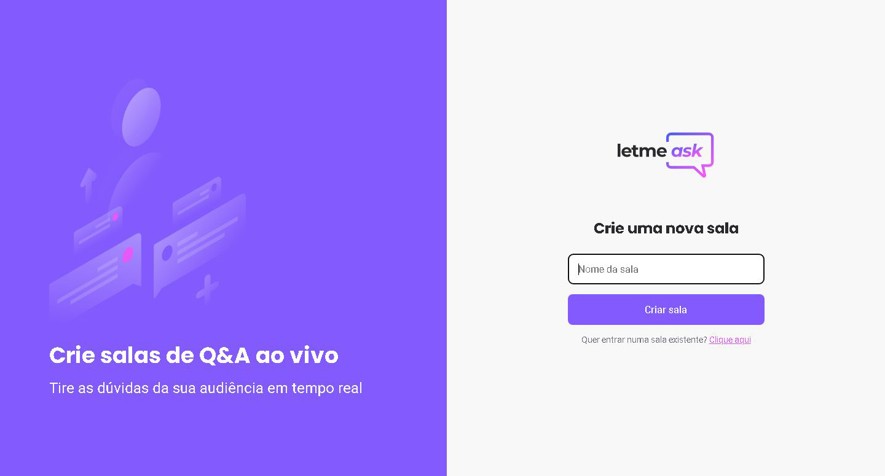

# NLW Together: React

    

## Letmeask
Letmeask is a Q&A application perfect for content creators who want to communicate with their audience in a simple and organized way.\
It was developed on Next Level Week – Together, an event by [Rocketseat](https://www.rocketseat.com.br/).

## How to Run
1. Clone this repo.
2. Run `npm i` to install dependencies.
3. Register on Firebase, create a new project and get your connection options to web version.
4. Add your web app's configuration on an `.env` file or directly on `src/services/firebase.ts`.
5. Run `npm start`.

## Layout
[Web layout](https://www.figma.com/community/file/1009824839797878169/Letmeask) by [Rebecca Gonzalez](https://www.figma.com/@rebecca).

